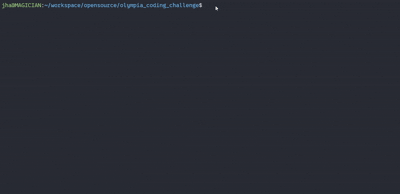

# Olympia EDM Proposal Coding Challenge

A video demonstrating the working of this.



To build and run:

```
g++ olympia_challenge.cpp -o describe_object
```

For manual build:
```
mkdir build && cd build
cmake ..
make 
./describe_object circle 12
```
